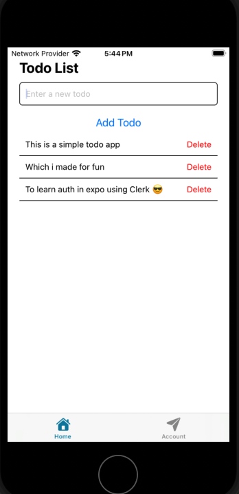

# Neon RLS Authorize + Clerk

A quick start Expo template demonstrating secure user authentication and authorization using Neon RLS Authorize with Clerk integration. This guide uses SQL from the client to enforce row-level security policies.

> [!IMPORTANT]  
> WIP: I built this project because **I couldn't find a simple, easy-to-understand example of Expo with Clerk auth on GitHub**. So, I decided to make one myself! It's going to be my go-to template for future projects. I'm having a blast learning mobile app development, and right now, I'm diving into CI/CD. I'm trying to automate deployments to the Google Play Store and the Apple App Store (yeah, I know EAS does a lot of that, but I want to learn the ins and outs). If you're a pro at mobile deployment automation and want to share your knowledge, I'd love your help! Pull requests are more than welcome. Thanks for checking it out!

## Features

- Expo application with TypeScript
- User authentication powered by Clerk
- Row-level security using Neon RLS Authorize
- Database migrations with Drizzle ORM
- Ready-to-deploy configuration for Netlify

## Prerequisites

- [Neon](https://neon.tech) account with a new project
- [Clerk](https://www.clerk.com) account with a new application
- Node.js 18+ installed locally

## One-Click Deploy

Deploy directly to your preferred hosting platform:

[](https://app.netlify.com/start/deploy?repository=https://github.com/dhanushreddy291/clerk-expo-neon-rls-authorize)


## Local Development Setup

### 1. Configure Clerk

1. Navigate to your Clerk dashboard and create a new application.
2. Obtain your **Publishable key** and **Secret key** from the Clerk dashboard.
    
3. In your Clerk dashboard, go to **JWT Templates**.
    
4. Create a new JWT Template (select "Blank" as the template type).
    
5. Name your template (e.g., `neon_rls_authorize`).
6. Copy the **JWKS Endpoint** URL. You'll need this for Neon RLS Authorize.
    

### 2. Set Up Neon RLS Authorize

1. Open your Neon Console and click on **RLS Authorize** in your project's settings.
2. Click **Add Authentication Provider**.
3. Paste the **JWKS Endpoint** URL you copied from Clerk into the **JWKS URL** field.
4. Follow the steps in the Neon UI to set up the `authenticated` role. You can skip the schema-related steps if you are just getting started with this example.

    

### 3. Local Installation

1. Clone the repository:

    ```bash
    git clone https://github.com/dhanushreddy291/clerk-expo-neon-rls-authorize
    cd clerk-expo-neon-rls-authorize
    ```

2. Install dependencies:

    ```bash
    npm install
    ```

3. Create a `.env` file in the root of the project and fill the following environment variables:

    ```bash
    cp .env.template .env
    ```

    ```env
    EXPO_PUBLIC_CLERK_PUBLISHABLE_KEY=YOUR_CLERK_PUBLISHABLE_KEY
   
    # For the `neondb_owner` role.
    DATABASE_URL="YOUR_NEON_OWNER_CONNECTION_STRING"
    # For the `authenticated`, passwordless role.
    EXPO_PUBLIC_DATABASE_URL=="YOUR_NEON_AUTHENTICATED_CONNECTION_STRING"
    ```

    > **Note:** Replace the placeholder values with your actual Neon and Clerk credentials.

4. Run the database migrations:

    ```bash
    npm run drizzle:generate
    npm run drizzle:migrate
    ```

5. Start the development server:

    ```bash
    npm run start
    ```

    Open the app by scanning the QR code with the Expo Go app on your phone or by running the following command:

    - Open in ios simulator: `i`
    - Open in android emulator: `a`
    - Open in web browser: `w`

    

## Important: Production Setup

Before deploying to production:

1. Modify your Clerk application environment to use the Production instance. Create one if you haven't already.
    
2. Update your environment variables with the new production credentials
3. Update your authentication configuration in Neon RLS Authorize with the new JWKS URL


## Learn More

- [Clerk Expo SDK](https://clerk.com/docs/references/expo/overview)
- [Clerk Expo Quickstart](https://clerk.com/docs/quickstarts/expo)
- [Neon RLS Authorize Tutorial](https://neon.tech/docs/guides/neon-authorize-tutorial)
- [Simplify RLS with Drizzle](https://neon.tech/docs/guides/neon-authorize-drizzle)
- [Clerk Documentation](https://clerk.com/docs)
- [Neon RLS Authorize + Clerk Integration](https://neon.tech/docs/guides/neon-authorize-clerk)

## Contributing

Contributions are welcome! Please feel free to submit a Pull Request.

